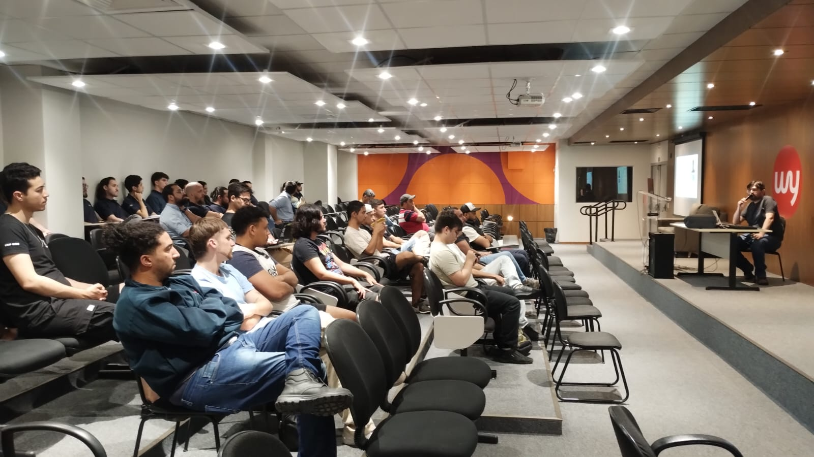

# Microservices-2024-08
Fotos e informações gerais sobre o evento "Microservices, Escalabilidade e Kubernetes", realizado em 31/08/2024 na cidade de Campinas-SP.

Organizadores:
- **João Ronaldo Cunha (UniMetrocamp)**
- **Renato Groffe (Microsoft MVP, MTAC)**

Palestrante: **Renato Groffe (Microsoft MVP, MTAC)**

Número de participantes: **36 pessoas**

Tópicos e tecnologias abordados: **Microservices, Arquitetura de Software, DevOps, Docker, Docker Desktop, Kubernetes, Azure Kubernetes Service, Linux, WSL, Trivy, Microsoft Azure, Azure Container Apps, Azure Container Instances, Azure Container Registry, Azure App Service, Grafana, Prometheus**

Acesse este [**link**](/img/) para visualizar todas as fotos das apresentações.

Este evento foi uma parceria entre a comunidade [**Azure na Prática**](https://www.youtube.com/azurenapratica) e a [**Escola Senai Suíço-Brasileira Paulo Ernesto Tolle**](https://suicobrasileira.sp.senai.br/).

Formulário utilizado para inscrições: [**Sympla**](https://www.sympla.com.br/evento/microservices-escalabilidade-e-kubernetes-gratuito-e-presencial-campinas-sp/2615614)

Local: UniMetrocamp - Rua Dr. Sales de Oliveira, 1661 - Vila Industrial - próximo da Rodoviária - CEP: 13035-500 - Campinas - SP

